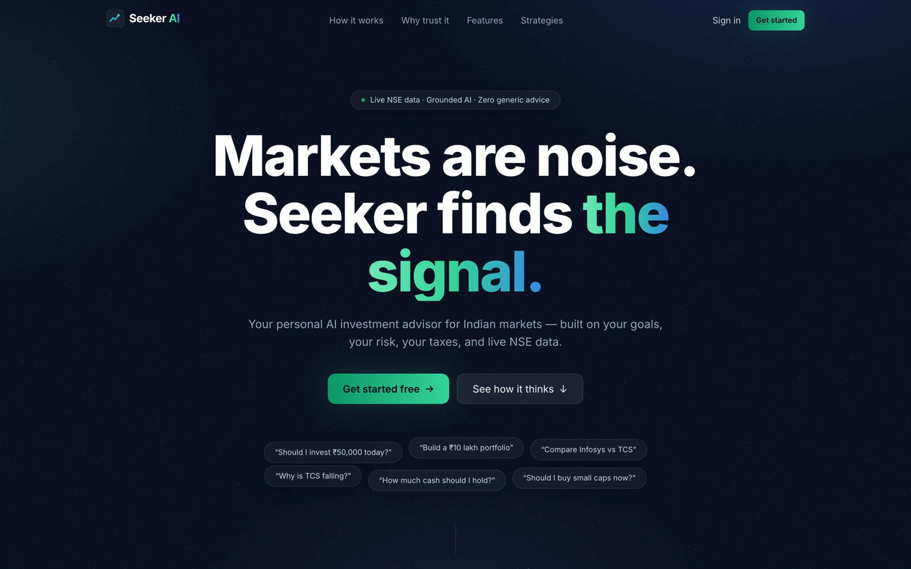
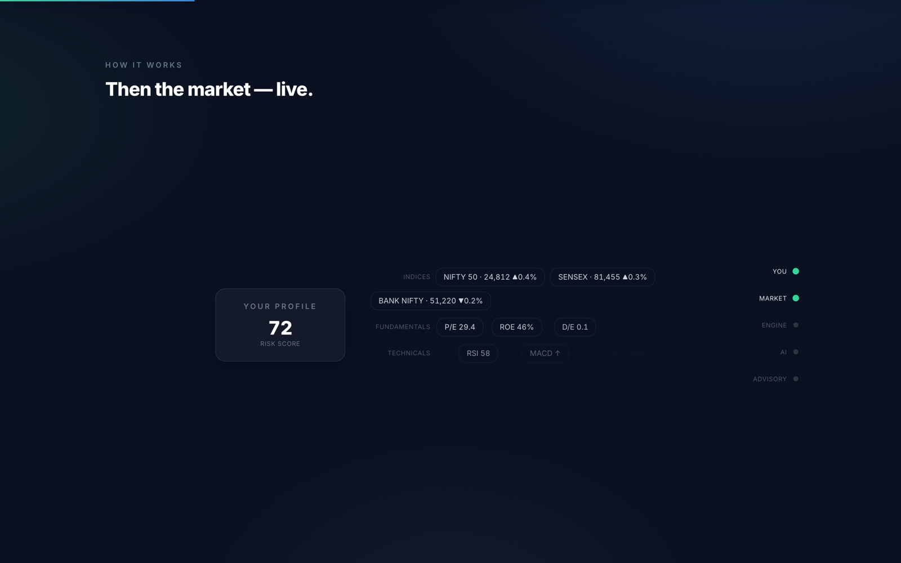
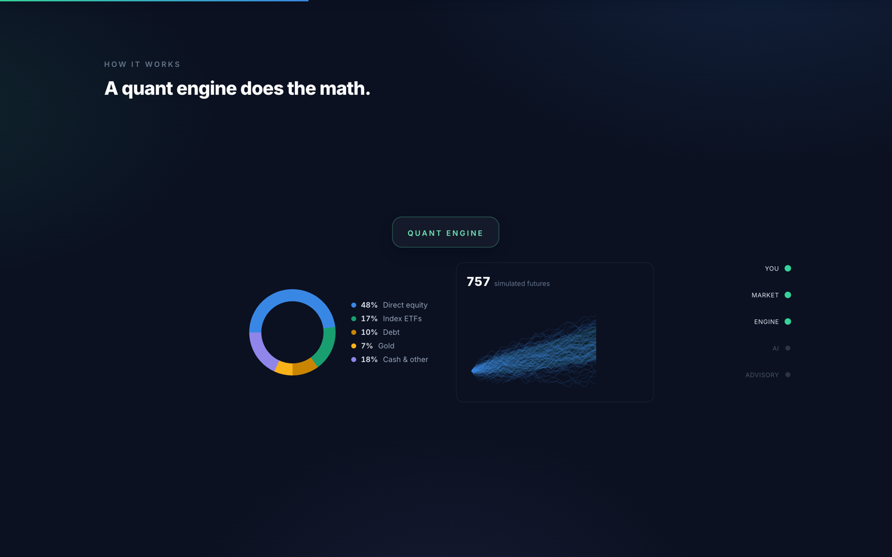
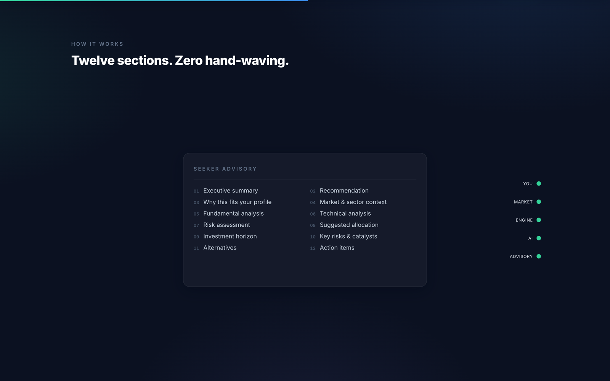
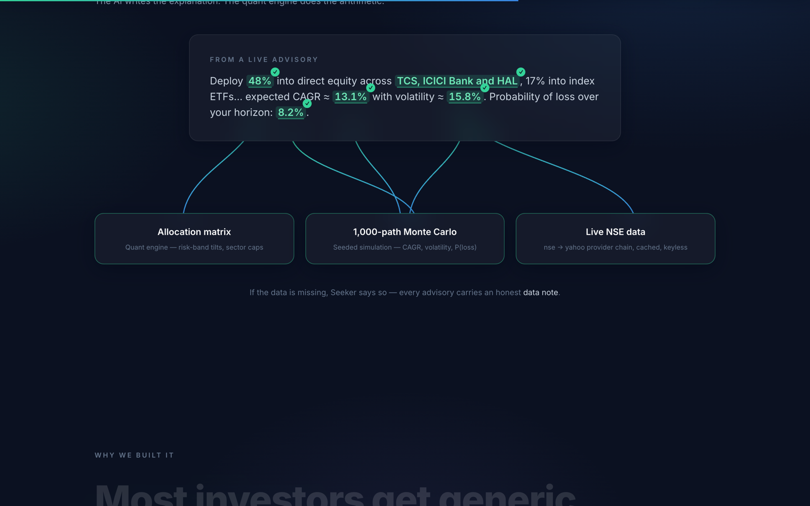
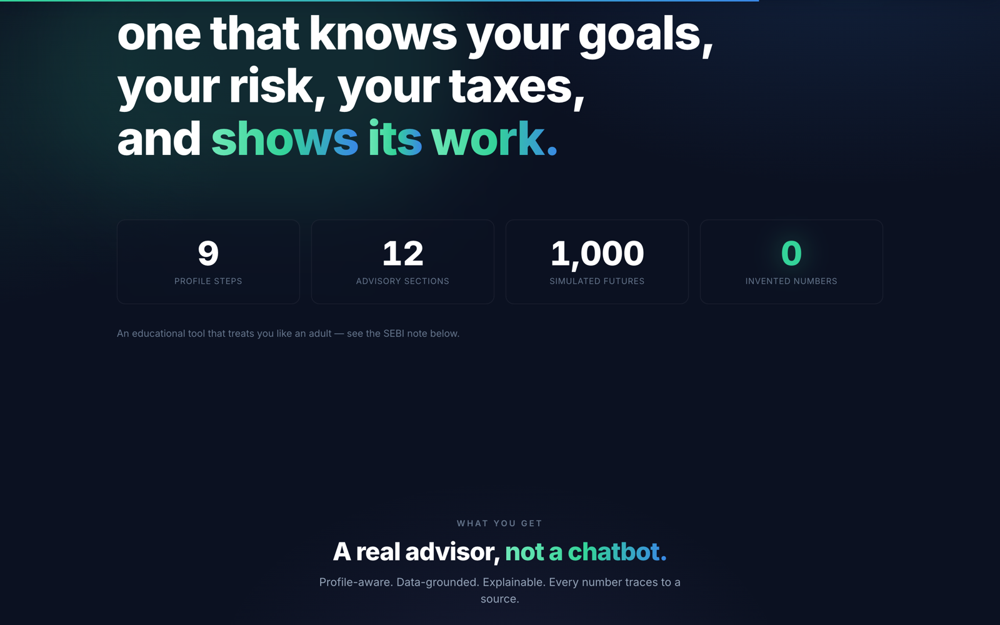
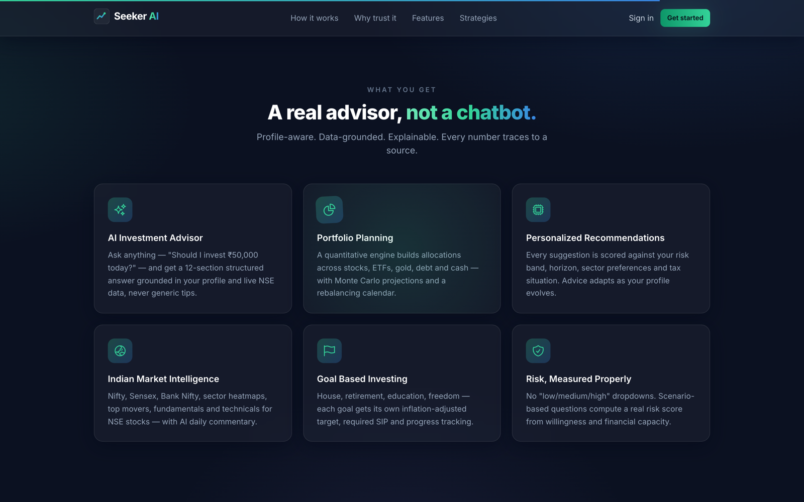
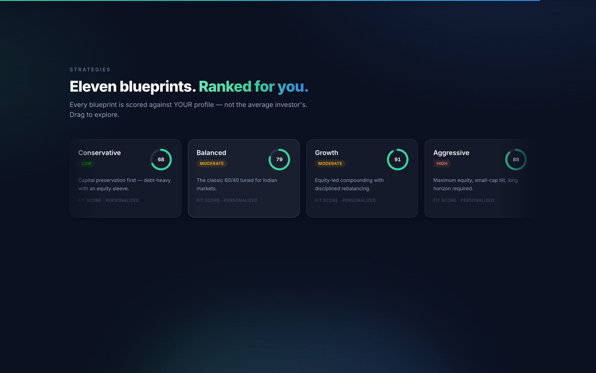
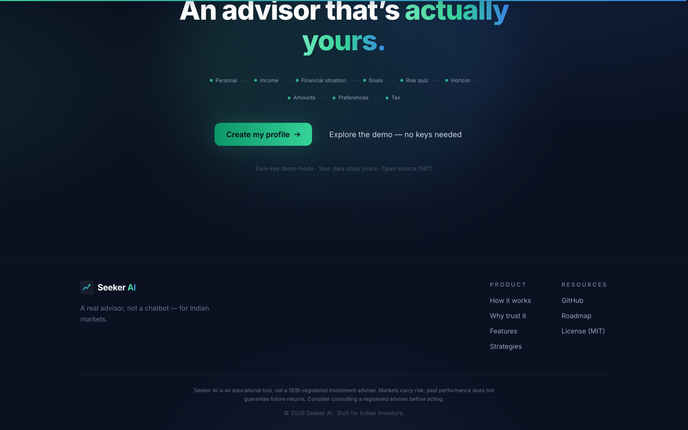

<div align="center">

# 🟢 Seeker AI — Landing Page

### Markets are noise. **Seeker finds the signal.**

An award-style animated landing page for **Seeker AI** — a personal AI investment advisor
for Indian markets, built on your goals, your risk, your taxes, and live NSE data.

<br/>


<br/>



</div>

---

## 📖 Table of contents

- [Highlights](#-highlights)
- [The three signature animations](#-the-three-signature-animations)
- [Page tour](#-page-tour)
- [Quick start](#-quick-start)
- [Scripts](#-scripts)
- [Project structure](#-project-structure)
- [Motion & performance budget](#-motion--performance-budget)
- [Integrating into FINANCE-AGENT](#-integrating-into-finance-agent)
- [Disclaimer](#%EF%B8%8F-disclaimer)

---

## ✨ Highlights

| | |
|---|---|
| 🎇 **WebGL "Noise → Signal" hero** | ~9,000 GPU particles snap from market chaos onto the Seeker chart-line |
| 🎬 **Pinned, scroll-scrubbed story** | A 5-scene "How Seeker thinks" sequence that builds a real advisory |
| 🔎 **Grounded-proof tracer beams** | Every claimed number is visually traced back to the engine that produced it |
| 🧲 **Kinetic manifesto** | Scroll-scrubbed type with the receipts: **9 · 12 · 1,000 · 0 invented numbers** |
| ♿ **Reduced-motion first** | Every scene has a static, readable fallback — no pin, no WebGL, no scrub |
| ⚡ **Lazy Three.js** | The 3D chunk stays out of the main bundle (~157 KB gz main, ~223 KB gz lazy) |

---

## 🎬 The three signature animations

### 1 · "Noise → Signal" hero
~9,000 GPU particles drift as market chaos, then snap onto the Seeker chart-line
(emerald → blue) in sync with the headline. WebGL with a custom shader, lazy-loaded
chunk, and a static SVG fallback for reduced-motion / no-WebGL.
→ [`src/features/landing/three/HeroCanvas.tsx`](src/features/landing/three/HeroCanvas.tsx)

### 2 · "How Seeker thinks"
A pinned, scroll-scrubbed 5-scene story that builds a real advisory: 9 profile chips →
risk ring 72/100 → live NSE pills → allocation donut + 1,000-path Monte Carlo fan →
typewriter advisory with citations → the 12-section document. Stacked cards on mobile,
static diagram under reduced-motion.
→ [`src/features/landing/components/HowSeekerThinks.tsx`](src/features/landing/components/HowSeekerThinks.tsx) + [`src/features/landing/pipeline/`](src/features/landing/pipeline/)

### 3 · "Every number traces to a source" + manifesto
Tracer beams verify each claimed number against its engine, then a scroll-scrubbed
kinetic manifesto lands the receipts: **9 · 12 · 1,000 · 0 invented numbers**.
→ [`GroundedProof.tsx`](src/features/landing/components/GroundedProof.tsx), [`Manifesto.tsx`](src/features/landing/components/Manifesto.tsx)

---

## 📸 Page tour

### How Seeker thinks — the pinned pipeline

Your profile meets the live market, a quant engine does the math, and the AI explains
without inventing a single number.

<table>
  <tr>
    <td width="50%"></td>
    <td width="50%"></td>
  </tr>
  <tr>
    <td align="center"><sub><b>Then the market — live.</b> Profile + live NSE pills</sub></td>
    <td align="center"><sub><b>A quant engine does the math.</b> Donut + Monte Carlo fan</sub></td>
  </tr>
</table>

<div align="center">
  
  <br/><sub><b>Twelve sections. Zero hand-waving.</b> The finished advisory document</sub>
</div>

### Why trust it — grounded proof

Tracer beams connect every number in a live advisory back to the engine that produced
it: the allocation matrix, the 1,000-path Monte Carlo, and live NSE data.



### The manifesto — with receipts



### What you get



### Strategies & final CTA

<table>
  <tr>
    <td width="50%"></td>
    <td width="50%"></td>
  </tr>
  <tr>
    <td align="center"><sub><b>Eleven blueprints.</b> Ranked against <i>your</i> profile</sub></td>
    <td align="center"><sub><b>An advisor that's actually yours.</b> 9-step profile → CTA</sub></td>
  </tr>
</table>

---

## 🚀 Quick start

```bash
git clone <this-repo>
cd seeker-landing

npm install
npm run dev        # → http://localhost:5173
```

Production build:

```bash
npm run build      # typecheck + production build (dist/)
npm run preview    # serve the production build
```

---

## 📜 Scripts

| Command | What it does |
|---|---|
| `npm run dev` | Start the Vite dev server |
| `npm run build` | Typecheck (`tsc --noEmit`) + production build to `dist/` |
| `npm run preview` | Serve the production build locally |
| `npm run typecheck` | Typecheck only |

---

## 🧱 Project structure

Everything ships as a self-contained feature folder — one file per section, motion
utilities isolated, and all product copy in a single ground-truth data module.

```
src/
├── components/            Logo, ButtonLink (shared UI)
├── lib/utils.ts           cn, seeded RNG, rAF tween
├── styles/globals.css     tokens, glass system, motion helpers
└── features/landing/
    ├── LandingPage.tsx    orchestrator — nav, sections, footer
    ├── data.ts            all product copy (ground truth from the repo)
    ├── motion/            gsap registration, Lenis provider, SplitWords, Reveal
    ├── three/             HeroCanvas (WebGL particles, lazy chunk)
    ├── pipeline/          scene components + RiskRing / Donut / MonteCarlo bits
    └── components/        one file per section (Hero, TickerStrip, FeatureGrid, …)
```

---

## ⚡ Motion & performance budget

- ✅ Respects `prefers-reduced-motion` everywhere — static fallbacks for every scene
- ✅ Animations pause offscreen; ScrollTrigger refreshes after webfonts settle
- ✅ Three.js stays out of the main bundle: **~157 KB gz** main, **~223 KB gz** lazy three chunk
- ✅ No horizontal overflow at any breakpoint; pinned scenes become stacked cards < 1024px
- ✅ Static SVG hero fallback when WebGL is unavailable

---

## 🔌 Integrating into FINANCE-AGENT

This project mirrors the monorepo's structure, so the merge is mostly file copies —
dependency pins (React 18 + R3F v8), copy targets, and the 5 re-wiring edits are all
documented in **[INTEGRATION.md](INTEGRATION.md)**.

---

## ⚠️ Disclaimer

> Market figures shown on the page are illustrative. **Seeker AI is an educational
> tool, not a SEBI-registered investment adviser.** Markets carry risk; past
> performance does not guarantee future returns. Consider consulting a registered
> adviser before acting.
